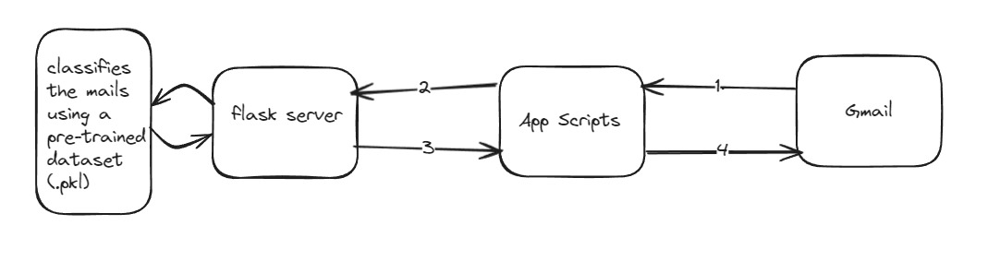

# Spam Detection for Gmail

An AI-based Mail Spam Detector for Gmail made using Naive Bayes Method and Intergated to Gmail using Google App Scripts (GAS) to classify the incoming mails as Spam or Ham mail.


## Installation

- ### Flask Installation - Server Side:

    - Clone the repo 
    
        ```
        git clone https://github.com/MSrikar7/Gmail-Spam-Detection.git
        ```
    - Go to 'flaskapp' directory
        ```
        cd Gmail-Spam-Detection/flaskapp 
        ```
    - Change Permission of install.sh
        ```
        chmod +x install.sh
        ```
    - Run Script
        ```
        sudo bash install.sh
        ```
- ### Integrating Gmail

    - Paste this link in your browser 
        ```
        https://script.google.com/d/1CNbjqf9Nente9LfWbIOewvGlAKpLm6PA2tiDBvhlf0Jh8y1jwDKYqeSE/edit?usp=sharing
        ```
    - Run and make sure that the function is 'setupTimeTrigger'

        

    - Give necessary permissions when prompted 
    
    - A trigger will start once you run. And if you want to stop the process, delete the trigger.

          

 


 
## Workflow

- 

    1. App Script has a trigger that continuosly checks for new mails (unlabelled)
    2. The New email content will be sent to flask server
    3. After classifying, it will send a binary value to app script whether it is a spam or a ham
    4. App scripts then labels it accordingly and forwards it to Gmail - UI.

